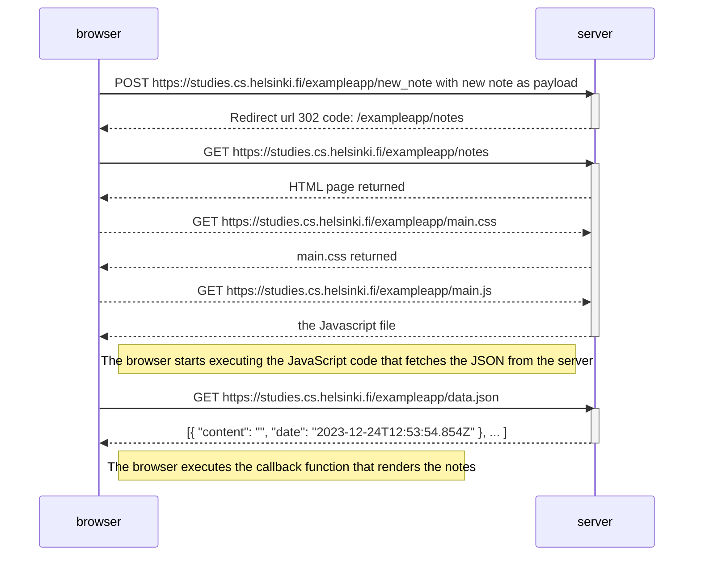

```mermaid
sequenceDiagram
    participant browser
    participant server

    browser->>server: POST https://studies.cs.helsinki.fi/exampleapp/new_note with new note as payload
    activate server
    server-->>browser: Redirect url 302 code: /exampleapp/notes
    deactivate server

    browser->>server: GET https://studies.cs.helsinki.fi/exampleapp/notes
    activate server
    server-->>browser: HTML page returned
    browser-->>server: GET https://studies.cs.helsinki.fi/exampleapp/main.css
    server-->>browser: main.css returned
    browser-->>server: GET https://studies.cs.helsinki.fi/exampleapp/main.js
    server-->>browser: the Javascript file
    deactivate server

    Note right of browser: The browser starts executing the JavaScript code that fetches the JSON from the server

    browser->>server: GET https://studies.cs.helsinki.fi/exampleapp/data.json
    activate server
    server-->>browser: [{ "content": "", "date": "2023-12-24T12:53:54.854Z" }, ... ]
    deactivate server

    Note right of browser: The browser executes the callback function that renders the notes
```