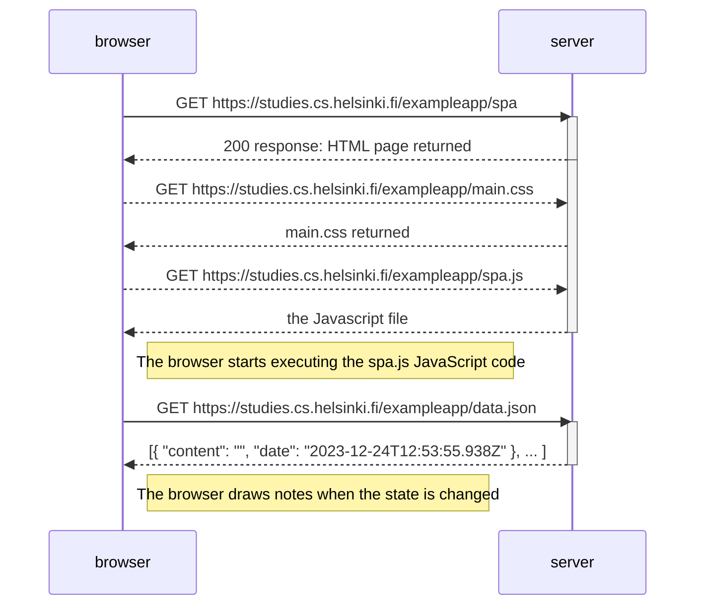

```mermaid
sequenceDiagram
    participant browser
    participant server

    browser->>server: GET https://studies.cs.helsinki.fi/exampleapp/spa
    activate server
    server-->>browser: 200 response: HTML page returned
    deactivate server

    activate server
    browser-->>server: GET https://studies.cs.helsinki.fi/exampleapp/main.css
    server-->>browser: main.css returned
    browser-->>server: GET https://studies.cs.helsinki.fi/exampleapp/spa.js
    server-->>browser: the Javascript file
    deactivate server

    Note right of browser: The browser starts executing the spa.js JavaScript code

    browser->>server: GET https://studies.cs.helsinki.fi/exampleapp/data.json
    activate server
    server-->>browser: [{ "content": "", "date": "2023-12-24T12:53:55.938Z" }, ... ]
    deactivate server

    Note right of browser: The browser draws notes when the state is changed
```