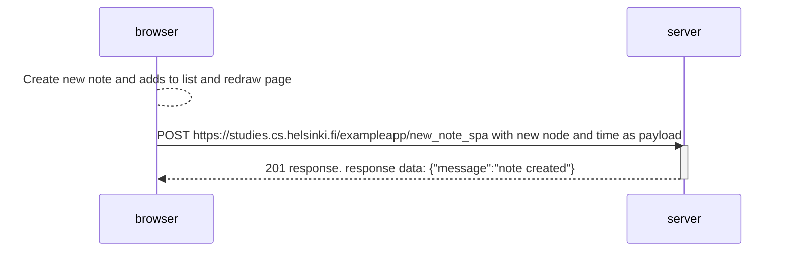

```mermaid
sequenceDiagram
    participant browser
    participant server

    browser-->browser: Create new note and adds to list and redraw page
    browser->>server: POST https://studies.cs.helsinki.fi/exampleapp/new_note_spa with new node and time as payload
    activate server
    server-->>browser: 201 response. response data: {"message":"note created"}
    deactivate server
```